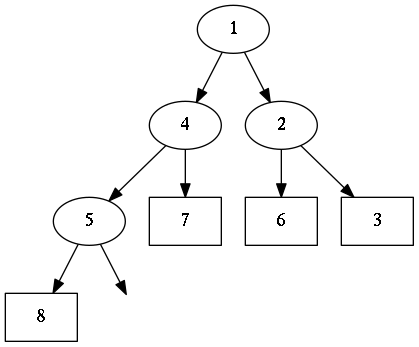
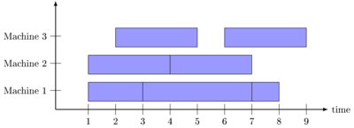
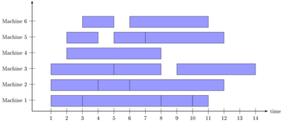

<h2>Table of Contents</h2>

<ul>
<li><a href="#orgheadline1">1. Generic Heap</a></li>
<li><a href="#orgheadline5">2. Demo</a>
<ul>
<li><a href="#orgheadline2">2.1. Simple Test</a></li>
<li><a href="#orgheadline3">2.2. Reverse Order</a></li>
<li><a href="#orgheadline4">2.3. Heap Sort Performance</a></li>
</ul>
</li>
<li><a href="#orgheadline8">3. Graphviz Output</a>
<ul>
<li><a href="#orgheadline6">3.1. Extensions</a></li>
<li><a href="#orgheadline7">3.2. Example</a></li>
</ul>
</li>
<li><a href="#orgheadline12">4. Application: Task Scheduling</a>
<ul>
<li><a href="#orgheadline9">4.1. Helper Classes</a></li>
<li><a href="#orgheadline10">4.2. Example</a></li>
<li><a href="#orgheadline11">4.3. A more complex example</a></li>
</ul>
</li>
</ul>

# Generic Heap

An array based implementation of a heap.

    using System;
    using System.Collections.Generic; 
    
    public class Heap<T> {
    
      public List<T> list;  
      Func<T, T, int> compare; 
    
      public Heap(Func<T, T, int> compare) {
        list = new List<T>();
        this.compare = compare; 
      }
    
      public Heap() : this((x,y) => Comparer<T>.Default.Compare(x,y)) { }
    
      public int Count {
        get { return list.Count; }
      }
    
      public void Insert(T value) {
        int index = list.Count; 
        list.Add(value); 
        int parentIndex = ParentIndex(index); 
        while(index > 0 && compare(list[index], list[parentIndex]) < 0) {
          Swap(index, parentIndex);
          index = parentIndex; 
          parentIndex = ParentIndex(index); 
        }
      }
    
      public T Remove() {
        if (list.Count == 0) throw new ArgumentOutOfRangeException("Cannot remove Element from empty Heap"); 
        T value = list[0];
        list[0] = list[list.Count-1];
        list.RemoveAt(list.Count-1); 
        int index = 0;                    
        while(index < list.Count) {
    
          int leftChildIndex = LeftChildIndex(index);
          if (leftChildIndex >= list.Count) break; 
    
          int childIndex = leftChildIndex; 
          int rightChildIndex = RightChildIndex(index); 
          if (rightChildIndex < list.Count && compare(list[rightChildIndex], list[leftChildIndex]) < 0 ) {
            childIndex = rightChildIndex;
          } 
          if (compare(list[index], list[childIndex]) < 0) break; 
          Swap(index,childIndex);
          index = childIndex;
        }
        return value; 
      }
    
      public static int ParentIndex(int index) { return (index-1)/2; } 
      public static int LeftChildIndex(int index) { return index*2+1; } 
      public static int RightChildIndex(int index) { return index*2+2; } 
    
      private void Swap(int i1, int i2) {
        T temp = list[i1];
        list[i1] = list[i2];
        list[i2] = temp; 
      }
    }

-   **Insertion:** O(log n)
-   **Removal:** O(log n)

Note:  Removal of the last element in a List<T> is O(1) (see <http://referencesource.microsoft.com/#mscorlib/system/collections/generic/list.cs,cf7f4095e4de7646>), O(n) otherwise. 

# Demo

## Simple Test

    using System; 
    
    public class Test {
    
      public static void Main() {
    
        var H = new Heap<int>();
        H.Insert(7);
        H.Insert(4);
        H.Insert(6);
        H.Insert(3);
        H.Insert(2);
        H.Insert(5);
        H.Insert(1);
    
        while(H.Count > 0) 
          Console.WriteLine(H.Remove());
      }
    }

    mcs demo/test.cs src/heap.cs
    mono demo/test.exe

    1
    2
    3
    4
    5
    6
    7

## Reverse Order

    using System; 
    
    public class TestCompare {
    
      public static void Main() {
    
        var H = new Heap<int>((x,y) => y - x);
        H.Insert(7);
        H.Insert(4);
        H.Insert(6);
        H.Insert(3);
        H.Insert(2);
        H.Insert(5);
        H.Insert(1);
    
        while(H.Count > 0) 
          Console.WriteLine(H.Remove());
      }
    }

    mcs demo/testcompare.cs src/heap.cs
    mono demo/testcompare.exe

    7
    6
    5
    4
    3
    2
    1

## Heap Sort Performance

Sort a Million numbers

    using System; 
    using System.Collections.Generic; 
    using System.Diagnostics; 
    
    public class Heapsort {
    
      public static void Main() {
    
        int n = 1000000;
        var random = new Random();
        var L = new List<int>(n);
        Console.WriteLine("Generating {0} random elements...", n); 
        for(int i = 0; i < n; i++)
          L.Add(random.Next()); 
    
        var H = new Heap<int>();
        Console.WriteLine("Sorting {0} random elements...", n); 
        var sw = Stopwatch.StartNew(); 
        foreach(var i in L) 
          H.Insert(i); 
        var elapsedInsert = sw.ElapsedMilliseconds;
        while(H.Count > 0) 
          H.Remove();
        var elapsedRemove = sw.ElapsedMilliseconds;
        sw.Stop(); 
        Console.WriteLine("Insertion: {0} Removal: {1} Combined: {2}", elapsedInsert, elapsedRemove, elapsedInsert + elapsedRemove); 
      }
    }

    mcs demo/heapsort.cs src/heap.cs 
    mono demo/heapsort.exe

    Generating 1000000 random elements...
    Sorting 1000000 random elements...
    Insertion: 61 Removal: 765 Combined: 826

Note:  Insertion is very fast while Removal is kind of slow. 

Both operations run in O(log n) time, but Insertion is way more fast. Tests show that in practice Up Bubbling rarely exceeds a few levels, while Down Bubbling almost *always* needs to process the whole tree height. 

# Graphviz Output

## Extensions

    using System;
    
    public static class HeapExtensions {
    
      private static void PrintNode<T>(T rootValue, T childValue) {
        Console.WriteLine("  \"{0}\" -> \"{1}\"", rootValue, childValue);
      }
    
      private static void PrintNode<T>(T value, int empties) {
        Console.WriteLine("  empty{0} [label=\"\", style=invis];", empties);
        Console.WriteLine("  \"{0}\" -> empty{1}", value,  empties);
      }
    
      private static void PrintSubTree<T>(Heap<T> heap, int index, ref int empties) {
    
        int leftChild = Heap<T>.LeftChildIndex(index);
    
        if (leftChild < heap.list.Count) {
          PrintNode(heap.list[index], heap.list[leftChild]);
          PrintSubTree(heap, leftChild, ref empties);
        } else {
          Console.WriteLine("  \"{0}\" [shape=rectangle];", heap.list[index]);
          PrintNode(heap.list[index], empties++);
        }
    
        int rightChild = Heap<T>.RightChildIndex(index); 
        if (rightChild < heap.list.Count) {
          PrintNode(heap.list[index], heap.list[rightChild]);
          PrintSubTree(heap, rightChild, ref empties);
        } else {
          PrintNode(heap.list[index], empties++);
        }
      }
    
      public static void PrintDot<T>(this Heap<T> heap) {
        Console.WriteLine("digraph G {");
        int empties = 0;
        PrintSubTree(heap, 0, ref empties); 
        Console.WriteLine("}"); 
      }
    }

## Example

Call extension method `PrintDot` and feed the results into [Graphviz](http://www.graphviz.org/): 

    class HeapTree {
      public static void Main() {
        var H = new Heap<int>();
        H.Insert(8);
        H.Insert(5);
        H.Insert(6);
        H.Insert(2);
        H.Insert(7);
        H.Insert(1);
        H.Insert(3);
        H.Insert(4);
    
        H.PrintDot(); 
      }
    }

    mcs demo/heaptree.cs src/heap.cs src/heapextensions.cs 
    mono demo/heaptree.exe

# Application: Task Scheduling

## Helper Classes

    using System;
    using System.Collections.Generic; 
    
    using Task = System.Collections.Generic.KeyValuePair<int, int>; 
    
    public class TaskScheduler {
    
      public class Machine {
        public List<Task> tasks; 
        public Machine() {  
          tasks = new List<Task>(); 
        }
    
        public static bool Overlaps(Task task1, Task task2) {
          if (task1.Value <= task2.Key) return false;
          if (task2.Value <= task1.Key) return false;
          return true; 
        }
    
        public bool Conflicts(Task task) {
          foreach(var t in tasks) {
            if (Overlaps(t, task) == true) return true; 
          }
          return false;
        }
    
        public void Add(Task task) {
          tasks.Add(task); 
        }
      }
    
      List<Machine> machines; 
    
      public TaskScheduler() {
        machines = new List<Machine>();
      }
    
      public void Schedule(Task task) {
        bool scheduled = false; 
        foreach(var m in machines) {
          if (!m.Conflicts(task)) {
            m.Add(task);
            scheduled = true;
            break;
          } 
        }
        if (scheduled == false) {
          var newMachine = new Machine();
          newMachine.Add(task);
          machines.Add(newMachine);
        }
      }
    
      public void PrintTikz() {
        System.Threading.Thread.CurrentThread.CurrentCulture = new System.Globalization.CultureInfo("en-GB"); 
        Console.WriteLine("\\begin{tikzpicture}[>=latex]");
        int y = 1;
        int maxTime = 0; 
        foreach (var machine in machines) {
          foreach(var task in machine.tasks) { 
            Console.WriteLine("  \\draw[fill=blue!40]({0},{1}) rectangle ({2},{3});",task.Key, y+0.1, task.Value, y+0.8);  
            maxTime = maxTime < task.Value ? task.Value : maxTime; 
          }
          y++; 
        }
        Console.WriteLine("  \\draw[thick,->](-0.2,0.8) -- ++(0,{0});", machines.Count+1); 
        for (int i = 0; i < machines.Count; i++) 
          Console.WriteLine("    \\draw(-0.4, {0}) node[left]{{Machine {1}}} -- ++ (0.4,0);", i+1+0.5, i+1); 
    
        Console.WriteLine("  \\draw[thick,->](-0.2,0.8) -- ++({0},0) node[right]{{time}};", maxTime+1); 
        for (int i = 0; i < maxTime; i++) 
          Console.WriteLine("    \\draw({0}, 0.6) node[below]{{{1}}} -- ++ (0,0.4);", i+1, i+1); 
    
        Console.WriteLine("\\end{tikzpicture}");
      }
    
    }

## Example

    using System;
    using System.Collections.Generic; 
    
    using Task = System.Collections.Generic.KeyValuePair<int, int>; 
    
    class TaskSchedule {
    
      public static void Main() {
        var tasks = new Heap<Task>((x,y) => x.Key - y.Key); 
        tasks.Insert(new Task(1,3));
        tasks.Insert(new Task(1,4)); 
        tasks.Insert(new Task(2,5)); 
        tasks.Insert(new Task(6,9)); 
        tasks.Insert(new Task(3,7)); 
        tasks.Insert(new Task(4,7)); 
        tasks.Insert(new Task(7,8)); 
        var scheduler = new TaskScheduler();
        while(tasks.Count > 0) {
          scheduler.Schedule(tasks.Remove()); 
        }
        scheduler.PrintTikz(); 
      }
    }

    mcs demo/taskschedule.cs demo/scheduler.cs src/heap.cs
    mono demo/taskschedule.exe

## A more complex example

    using System;
    using System.Collections.Generic; 
    
    using Task = System.Collections.Generic.KeyValuePair<int, int>; 
    
    class TaskSchedule {
      public static void Main() {
    
        int n = 16; 
        int maxStartTime = 10; 
        int maxRunningTime = 8; 
    
        var random = new Random(); 
        var tasks = new Heap<Task>((x,y) => x.Key - y.Key); 
        Func<int, int, Task> MakeTask = ((t1,t2) => {int x = random.Next(1,t1+1); return new Task(x, x+random.Next(1,t2+1));});
    
        for(int i = 0; i < n; i++)
          tasks.Insert(MakeTask(maxStartTime, maxRunningTime)); 
    
        var scheduler = new TaskScheduler();
        while(tasks.Count > 0) {
          scheduler.Schedule(tasks.Remove()); 
        }
        scheduler.PrintTikz(); 
      }
    }

    mcs demo/taskschedule2.cs demo/scheduler.cs src/heap.cs
    mono demo/taskschedule2.exe

